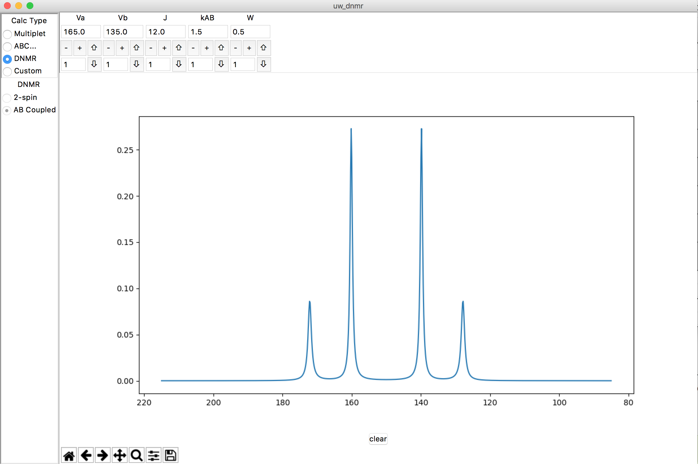

Overview of Project
===================

Original Visual Basic 6 screenshot ('ABX simulation')
-----------------------------------------------------

.. image:: docs/source/original_VB6_ABX.png

Besides style, note the extra graphics displayed below the spectrum... an
algorithm draws lines showing how the splitting pattern originates, and
clicking/dragging them changes the spectrum itself. **Interactive plots with
extra graphical objects!**

Python/tkinter implementation of ABX simulation
-----------------------------------------------

.. image:: docs/source/ABX.png

Python/tkinter implementation of "popup" window for matrix of inputs
--------------------------------------------------------------------

.. image:: docs/source/second_order_popup.png

Python/tkinter implementation of DNMR AB model
----------------------------------------------

This is the model that minicontroller/minimodel implement.