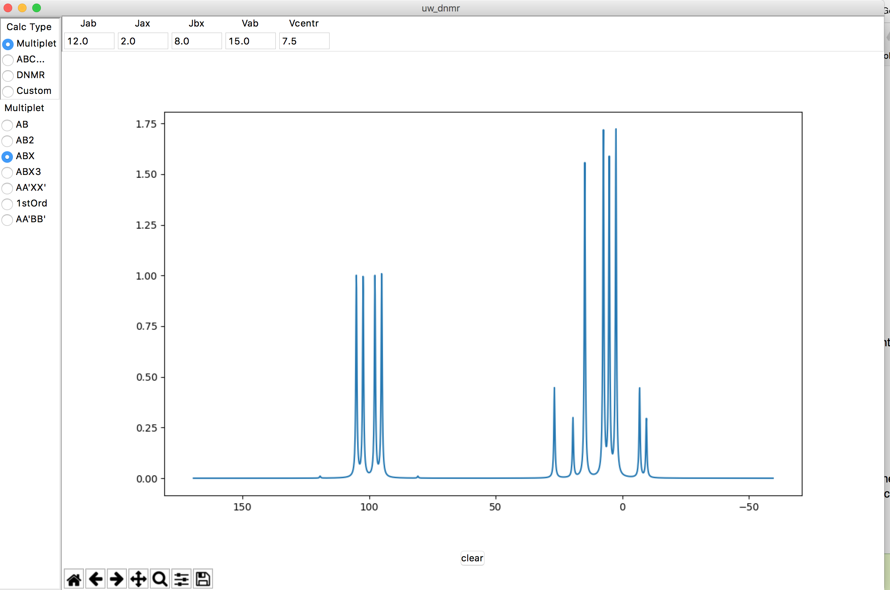

Overview of Project
===================

The goal of the uw_dnmr project is to take an old scientific app, written in
Visual Basic 6, and convert it into a cross-platform, open-source app.

The model and controller of the MVC archetecture is a Python 3 backend. The
current View is tkinter with a Matplotlib canvas embedded in the GUI. The
tkinter framework is awkward, and the plotting is slow. Also, interactivity
with the plotted data is desired (e.g. grab a peak in the spectrum, drag
left, and the spectrum changes accordingly).

The app as it currently stands can be executed by executing main.py.

To test the feasibility of creating a JavaScript front-end and turning this
into a web app, the app has been stripped down to one type of calculation
('DNMR-AB'). I have created model.minimodel and controller.minicontroller
modules. Executing minicontroller.py generates a set of plot data--a tuple of
numpy arrays for x and y coordinates.

My thought is: as a starting point, the controller
should be able to instantiate the view with a starter plot. The view
should allow the user to change the default values for the variables, then
request a refresh from MiniController ('live updates').

Original Visual Basic 6 screenshot ('ABX simulation')
-----------------------------------------------------

Besides style, note the extra graphics displayed below the spectrum... an
algorithm draws lines showing how the splitting pattern originates, and
clicking/dragging them changes the spectrum itself. **Interactive plots with
extra graphical objects!**

Python/tkinter implementation of ABX simulation
-----------------------------------------------

Python/tkinter implementation of "popup" window for matrix of inputs
--------------------------------------------------------------------

Python/tkinter implementation of DNMR AB model
----------------------------------------------

.. image:: docs/source/DNMR_AB_python.png

This is the model that minicontroller/minimodel implement.