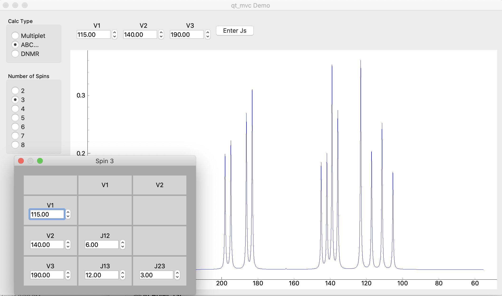

UW-DNMR v0.3.0 (alpha)
**********************

**UW-DNMR** (Un-Windowed Dynamic NMR; pronounced "You Dee En Em Arr") is a
Python implementation of the core features of WinDNMR by Hans Reich. The
current goal is to replicate the features of WinDNMR and to provide a
useful open-source application for Mac and Linux as well as Windows.

Features
========

Currently uw-dnmr can simulate the following systems for spin-1/2 nuclei:

* First-Order multiplets
* Non-quantum mechanical solutions for common second-order patterns:

  * AB
  * AB\ :sub:`2`
  * ABX
  * ABX\ :sub:`3`
  * AA'XX'
  * AA'BB'

* Second-order spin systems of up to 8 nuclei
* Dynamic NMR (DNMR) lineshapes for:

  * two uncoupled nuclei
  * two coupled nuclei

Installation
============

Installers for Mac (.dmg) and for Windows (.msi) can be found on the
`releases page`_.

.. _releases page: https://github.com/sametz/uw_dnmr/releases

Version History
===============

See CHANGELOG.rst for the version history and a map towards Version 1.0.

Feedback
========

I welcome feedback on this project. Feel free to leave an issue on Github, or
contact me by email (sametz@udel.edu).

Acknowledgements
================

Acknowledgements
================

Hans Reich (University of Wisconsin-Madison) kindly shared his original Visual Basic 6 code,
which served as a guide to recreating the functionality and structure of WinDNMR.

The :code:`nmrsim` library provides the functions used to calculate the NMR lineshapes.
See `the nmrsim project`_ for details.

.. _the nmrsim project https://github.com/sametz/nmrsim
